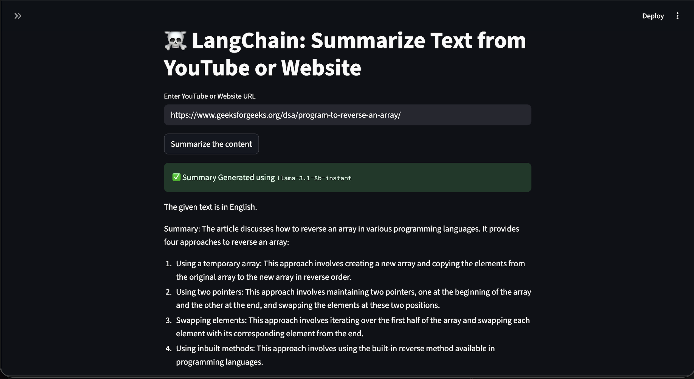

# 📄 LangChain Summarizer – Summarize YouTube Videos & Websites Using Gemini
<div align="center">


</div>

---

# 📌 Overview

This project is an AI-powered text summarization application built using **LangChain**, **Google Gemini**, and **Streamlit**.

It allows users to generate concise summaries from:

- 🎥 YouTube Videos
- 🌐 Website URLs

The application extracts content from the provided source and leverages Google's Gemini LLM through LangChain to generate accurate and meaningful summaries.

---

# 🚀 Features

- Summarize YouTube videos
- Summarize Website articles
- Powered by Google Gemini
- Built using LangChain
- Clean Streamlit Interface
- Fast response generation
- Easy to use

---

# 🏗️ Project Structure

```text
.
├── app.py
├── check.py
├── requirements.txt
├── README.md
└── final_one.png
```

| File | Description |
|-------|-------------|
| app.py | Main Streamlit application |
| check.py | Testing / utility script |
| requirements.txt | Python dependencies |
| final_one.png | Application Screenshot |
| README.md | Project documentation |

---

# ⚙️ Tech Stack

- Python
- LangChain
- Google Gemini
- Streamlit
- BeautifulSoup
- YouTube Loader
- Requests

---

# 📦 Installation

## Clone Repository

```bash
git clone https://github.com/yourusername/LangChain-Summarize-Text-from-YouTube-or-Website.git

cd LangChain-Summarize-Text-from-YouTube-or-Website
```

---

## Create Virtual Environment

### Windows

```bash
python -m venv .venv

.venv\Scripts\activate
```

### macOS/Linux

```bash
python3 -m venv .venv

source .venv/bin/activate
```

---

## Install Dependencies

```bash
pip install -r requirements.txt
```

---

# 🔑 Configure API Key

Create a `.env` file in the project root.

```env
GOOGLE_API_KEY=YOUR_GEMINI_API_KEY
```

---

# ▶️ Run Application

```bash
streamlit run app.py
```

The application will open in your browser.

---

# 💡 How it Works

## Website Summarization

1. Enter Website URL
2. Website content is extracted
3. LangChain processes the text
4. Gemini generates the summary
5. Summary is displayed

---

## YouTube Summarization

1. Paste YouTube URL
2. Video transcript is extracted
3. Transcript is processed
4. Gemini generates the summary
5. Summary is displayed

---

# 🧠 Architecture

```text
User
   │
   ▼
Streamlit UI
   │
   ▼
LangChain
   │
   ├──────────────┐
   ▼              ▼
Website Loader   YouTube Loader
        │
        ▼
 Document Processing
        │
        ▼
 Google Gemini
        │
        ▼
 Summary
```

---

# 📷 Application Screenshot

Add your screenshot below.

```
final_one.png
```

Example:

```markdown

```

---

# 📚 Dependencies

Major libraries used:

- langchain
- langchain-google-genai
- google-generativeai
- streamlit
- requests
- beautifulsoup4
- youtube-transcript-api

---

# 🔥 Future Improvements

- PDF Summarization
- Audio File Summarization
- Multiple Language Support
- Download Summary as PDF
- Save Summary History
- Dark Mode
- Better UI
- Streamlit Cloud Deployment

---

# 🛠️ Common Errors

## Invalid Gemini API Key

```
Authentication Error
```

Solution

- Verify API key
- Enable Gemini API

---

## No Transcript Available

Some YouTube videos don't provide transcripts.

Use another video.

---

## Rate Limit Exceeded

Occurs when Gemini quota is exhausted.

Solution

- Wait for quota reset
- Upgrade API quota

---

## Website Cannot Be Loaded

Possible reasons

- Website blocks scraping
- Invalid URL
- SSL issue

---

# 🤝 Contributing

Contributions are welcome.

1. Fork repository

2. Create new branch

```bash
git checkout -b feature-name
```

3. Commit changes

```bash
git commit -m "Added feature"
```

4. Push branch

```bash
git push origin feature-name
```

5. Open Pull Request

---

# 📄 License

This project is licensed under the MIT License.

---

# 👨‍💻 Author

**Prateek Choudhary**

GitHub:
https://github.com/Prateek13052003

---

## ⭐ If you found this project useful, don't forget to Star the repository!
